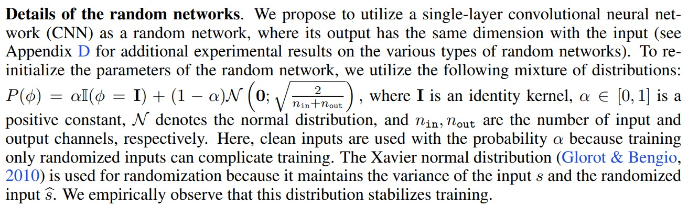

# rand_conv

This repo shows how to create on-demand random colour augmentations by convolving the image with random conv2d filters. This has shown to improve the performance in RL as well as image classification by https://arxiv.org/abs/1910.05396 and https://openreview.net/pdf?id=BVSM0x3EDK6

The filter weights are initialised from a normal distribution with standard deviation of 1 / sqrt(C_in) * kernel_size. Since we are dealing with 3 channel input images C_in is 3 and we also want output to be 3 channel.

```
# create the random_conv filter 
m = nn.Conv2d(3, 3, kernel_size, stride=1, padding=kernel_size//2, bias=False).cuda()

std_normal = 1 / (np.sqrt(3) * kernel_size)

m.weight = torch.nn.Parameter(torch.normal(mean=torch.zeros_like(m.weight), 
                                            std=torch.ones_like(m.weight)*std_normal))
```

However, as mentioned in the paper https://arxiv.org/abs/1910.05396, training only randomised inputs complicates training. Therefore, we do blending as suggested 



# Dependencies

Install the following via pip

```
fire
matplotlib
torch
```

# How to run 

The function call arguments are made via `fire`. Therefore, to understand what arguments to be passed, we'd recommend to do this first

```
python rand_conv.py --help
```

It will show you the following help for commandline arguments

```
NAME
    rand_conv.py - A function to apply random convolution filters to the image 
                   input (H x W x 3) ->rand_conv-> output (H x W x 3)

SYNOPSIS
    rand_conv.py <flags>

DESCRIPTION
    @param: kernel_size is the size of the convolution filter to be used 
    @param: weight_init is the initalisation scheme (whether it's normal or xavier etc.) 
    @param: alpha is the blending parameter i.e. alpha*input_image + (1-alpha)*convolved_image 
    @param: save_images is for saving the blended images

FLAGS
    --kernel_size=KERNEL_SIZE
    --weight_init=WEIGHT_INIT
    --alpha=ALPHA
    --save_images=SAVE_IMAGES
(END)
```
